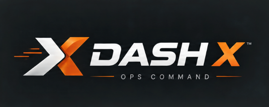

# DashX — Live Vehicle Service Operations Command Center

DashX is an enterprise-grade, automotive operations dashboard and dispatch intelligence platform built for vehicle service networks. It features real-time WebSocket telemetry, automated mechanic dispatching, live fleet mapping, and financial ledger analytics.



---

## ⚡ Architecture & Tech Stack

### Frontend
- **Framework**: React 18 + TypeScript + Vite
- **Styling**: Tailwind CSS (v4) with custom automotive telemetry palette
- **Theme**: Dark / Light Mode with instant persistence and high-contrast color systems
- **Routing**: React Router DOM (v6)
- **Data Fetching & State**: TanStack Query (React Query)
- **Real-time Engine**: WebSocket Client (`useWebSocket` hook with auto-reconnect)
- **Visuals & Charts**: Recharts & Framer Motion
- **Icons**: Lucide React

### Backend
- **Framework**: Django 5 + Django REST Framework (DRF)
- **ASGI & WebSockets**: Django Channels + Daphne
- **Database**: SQLite (pre-seeded with 650+ realistic Indian automotive service bookings)
- **API Spec**: OpenAPI 3.0 via `drf-spectacular`
- **Quality**: 27 passing automated unit & integration tests

---

## 🚀 Quick Start Guide

### 1. Backend Setup

```bash
cd backend

# Create & activate virtual environment (optional)
python -m venv venv
# On Windows:
.\venv\Scripts\activate
# On Linux/macOS:
source venv/bin/activate

# Install dependencies
pip install -r requirements.txt

# Run migrations & seed data (if starting fresh)
python manage.py migrate
python manage.py seed_database

# Start the Django ASGI Server
python manage.py runserver 8000
```
Backend API will be accessible at `http://127.0.0.1:8000/api/` and Swagger docs at `http://127.0.0.1:8000/api/docs/`.

---

### 2. Frontend Setup

```bash
cd frontend

# Install packages
npm install

# Start Vite Dev Server
npm run dev
```
Frontend dashboard will be accessible at `http://127.0.0.1:5173/`.

---

## 📊 Core Pages & Workspaces

1. **Command Center (`/`)**:
   - Dark mechanical hero banner with environmental telemetry (Gurugram weather & AQI)
   - 8 Real-time KPI summary cards with trend subtexts
   - Bookings Over Time & Revenue Over Time charts with period totals
   - Booking Status Overview donut chart
   - Fleet Pulse, Recent Live Activity, and Live Fleet Map of Gurugram hubs

2. **Bookings Management (`/bookings`)**:
   - Comprehensive dispatch ledger with multi-column filtering, search, and sorting
   - Slide-over Booking Detail Work Order Drawer with status transition actions

3. **Field Mechanics & Dispatch (`/mechanics`)**:
   - Live availability tracking, mechanic rating cards, and assignment HUDs
   - Inline status updates (Available, Busy, On Trip, Offline)

4. **Customer Registry (`/customers`)**:
   - Customer profile registry with garage fleet metrics and lifetime spend tracking

5. **Analytics (`/analytics`)**:
   - Deep dive telemetry, status distribution, and top service category breakdown

6. **Operations & Financial Reports (`/reports`)**:
   - Financial ledger audit statements, technician SLA compliance, and live CSV export

7. **Alerts & Exceptions (`/alerts`)**:
   - Real-time SLA bottlenecks, unassigned booking escalations, and technician pool shortages

8. **Settings (`/settings`)**:
   - Automated dispatch heuristics, radius limits, WebSocket parameters, and station profiles

---

## 🛡️ License
Proprietary — DashX Operations Command.
